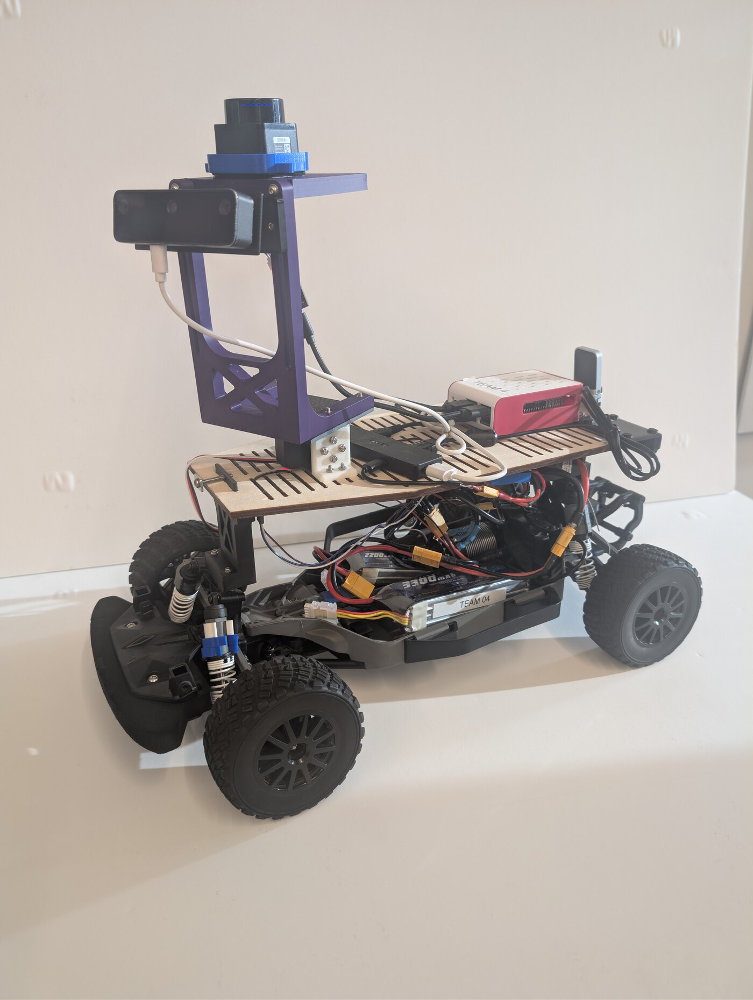
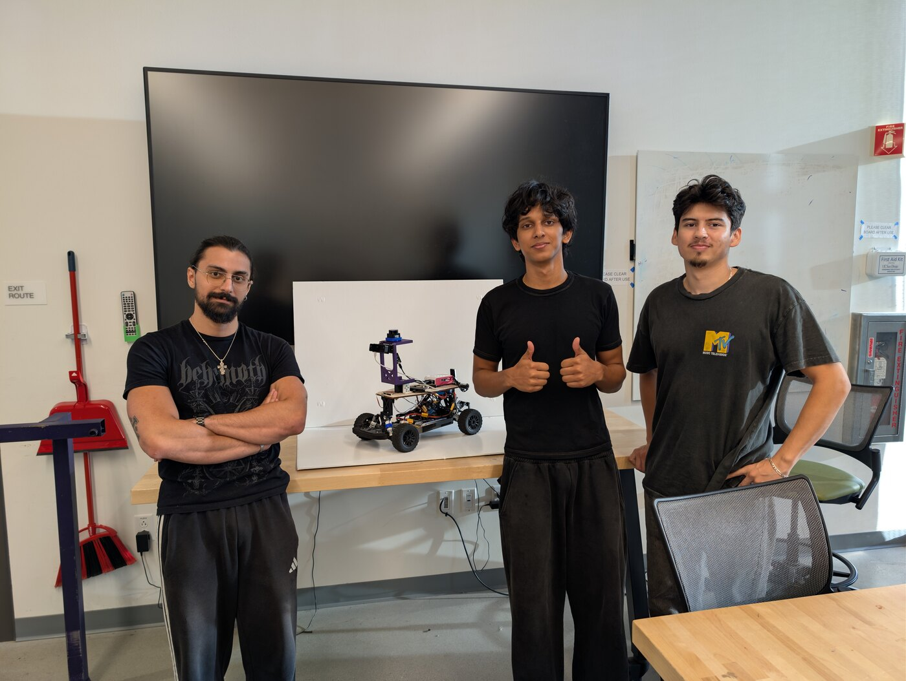
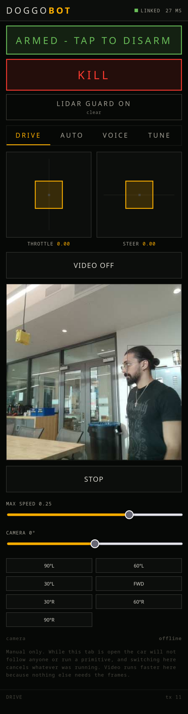
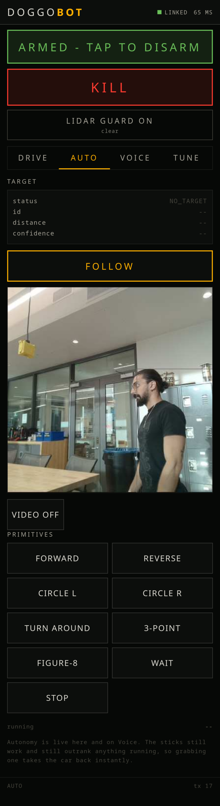
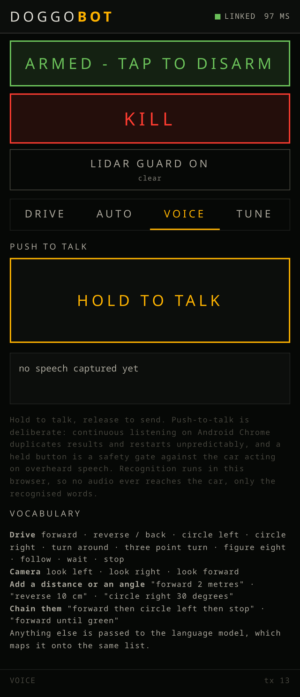
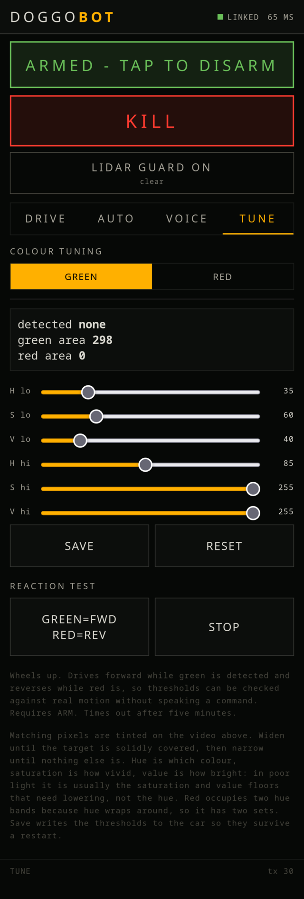

<p align="center">
  
</p>

# UCSD ECE/MAE 148 Team 4 &mdash; Doggobot

**Voice-Controlled Autonomous Navigation** &middot; Summer Session II, 2026

<p align="center">
  
</p>


<p align="center">
  <a href="https://youtu.be/nzANNk37lwg">
    
  </a>
</p>

<p align="center"><a href="https://youtu.be/nzANNk37lwg"><b>&#9654;&nbsp; Watch the demo</b></a></p>

---

## Table of Contents

- [Team Members](#team-members)
- [Abstract](#abstract)
- [Demo](#demo)
- [Final Project](#final-project)
  - [What we promised](#what-we-promised)
  - [Beyond the proposal](#beyond-the-proposal)
- [Challenges, and what they taught us](#challenges-and-what-they-taught-us)
- [If we had another week](#if-we-had-another-week)
- [Final Project Documentation](#final-project-documentation)
  - [How it works](#how-it-works)
  - [Software](#software)
  - [Hardware](#hardware)
  - [CAD](#cad)
- [Reproducing this](#reproducing-this)
- [Using it](#using-it)
- [Acknowledgements](#acknowledgements)
- [Contact](#contact)

---

## Team Members

| Name | Department | Class |
|---|---|---|
| Cesar Montiel | Electrical and Computer Engineering | Junior |
| Hektoras Djabra (Hrag Djabraian) | Mechanical Engineering | Senior |
| Naveen Weedagama | Mechanical Engineering | Sophomore |

<p align="center">
  
</p>

---

## Abstract

A 1/10 scale autonomous car that takes spoken commands and carries them out, either as single
actions or as multi-step sequences with conditions attached. You can talk to it directly, or from
anywhere on the network through a phone web app that also gives you sticks, a kill switch, live
video and telemetry.

It runs **nine ROS2 nodes of our own** alongside the class `ucsd_robocar_hub2` framework, eleven
in total, on a Raspberry Pi 5 with an OAK-D Lite and an LD06 LiDAR. Perception runs on the
camera's own accelerator; speech runs offline on the car or in the phone's browser; the camera
sits on its own servo and tracks independently of the wheels; and nothing that can move the car
does so until it is deliberately armed.

---

## Demo

Three clips: spoken commands carried out, person following with the camera tracking
independently of the wheels, and the camera searching to reacquire a target it has lost.

[](https://youtu.be/nzANNk37lwg)

**https://youtu.be/nzANNk37lwg**

---

## Final Project

### What we promised

**Must haves**

| Promised | Delivered |
|---|---|
| Voice command input | **Yes.** Two independent paths: an on-board microphone running Vosk offline with a wake word, and browser speech recognition on a phone. Both publish to the same topic, so the car cannot behave differently depending on how it was told |
| Command sequencing | **Yes.** Spoken chains: _"atlas forward then circle left then stop"_ |
| Autonomous driving | **Yes.** Person-following, with the camera and the steering as separate loops. Validated on the ground |
| Camera-based detection | **Yes.** A YOLO11n person detector we trained ourselves, running on the OAK-D Lite at 12.3 fps with stereo depth and on-camera tracking, plus HSV colour detection for the mission cues |
| Conditional actions | **Yes.** _"forward until green then circle left then stop"_. Steps wait on observed world state, with the step duration doubling as a timeout so an absent condition cannot strand the car |

**Nice to haves**

| Promised | Delivered |
|---|---|
| Object recognition beyond colour | **Yes.** The trained person detector, used for following |
| Natural language / complex chains | **Yes.** Anything the offline keyword vocabulary cannot parse escalates to a language model we host ourselves, which returns a schema-constrained command list. Typically under a second, and no cloud API is involved |
| Hardware change: camera pan servo | **Yes.** See below |

### Beyond the proposal

- **The camera moves.** A serial-bus servo pans the OAK-D, so the head and the wheels are
  separate control loops: the camera keeps the person framed and the car steers toward wherever
  the camera is looking. It matters most when the car is stopped, because a car cannot turn while
  stationary, so at that moment the camera is the only thing that can still aim.
- **Search on target loss.** When the lock drops the camera sweeps to find the person again,
  starting toward the side they were last seen on.
- **Spoken camera commands**, independent of driving: _"atlas look left"_,
  _"look 45 degrees to the right"_.
- **Phone web app** as the control surface: push-to-talk, dual sticks, kill switch, arm gate,
  primitive buttons, live video with the tracking overlay, camera pan control, and colour
  threshold tuning with live sliders. Installable to a home screen and served over HTTPS.
- **LiDAR proximity guard** covering the roughly 290 degrees the camera cannot see, with a phone
  override for bench work.
- **Boots to phone control unattended**, verified from a cold power cycle with no terminal.
- **Measured, not guessed.** Travel distance, turn rate and the camera's effective field of view
  were all measured on the vehicle and are recorded with the method used.

---

## Challenges, and what they taught us

Each of these cost real time. All are written up in dated detail in [build_log.md](build_log.md).

**A detector reporting 92% confidence can still be producing nonsense.** Our first working
pipeline emitted bounding boxes 24 times the image height, at high confidence. The cause was one
wrong field in the model archive: the decoding `subtype` describes the Luxonis *export format*,
not the model's architecture generation. Confidence measures agreement with a decode, so a wrong
decode can be confidently wrong.

**Where a motor starts is not where it runs smoothly.** We measured the motor starting at 1000
ERPM and built the whole throttle law on it. At that speed the motor controller could not hold a
setpoint at all: commanded 993 ERPM it wandered over a 1676 ERPM range while drawing 14.6 A,
against 3.0 A at cruise. The usable floor is more than double the starting threshold, and the
class calibration had been saying so all along.

**The number on the datasheet was right, and still the wrong number.** The camera's published
69 degree field of view describes the **lens**. The detector is fed a centre **crop** of the
sensor, so the angle its output actually spans is much narrower, and we were using a value 36%
too large. The camera over-corrected and hunted. We measured the real value by holding a target
still, moving the camera a known amount and watching the image offset change, using the pan
servo's encoder as a ruler.

**A safety system must observe intent, not an outcome it is already influencing.** The LiDAR
guard first read `/cmd_vel` to decide which way the car was going, but that is the arbiter output
the guard itself vetoes: stopping the car made it conclude nothing was moving, release, and let
the car lurch. It now reads the arbiter's inputs.

**A threshold with no hysteresis chatters.** The same guard compared range against a fixed
distance at 20 Hz, so an object sitting near that distance toggled the veto every tick and chopped
a three second command into fragments: 16 stop/release cycles in one minute. A release margin and
a minimum hold time fixed it, and neither changes the distance at which it intervenes.

**A partially understood command must be refused, not partially executed.** "Forward then jump
then stop" originally drove the car forward, and "forward until purple" ran a plain forward.
Silently doing a fragment of what someone asked is worse than doing nothing, because they have no
way to know which fragment they got.

**A software bug can present as a hardware fault.** Stopping a node left an orphan process alive,
so two nodes published drive commands to the same topic and the car alternated between them tens
of times a second. It looked exactly like a failing servo. Exactly one node now publishes
`/cmd_vel`; everything else proposes.

**Confirm the experiment ran before interpreting the result.** We spent several rounds diagnosing
a microphone that turned out to be recording an empty room.

---

## If we had another week

- **Replace the supplied motor-controller node.** One change buys three things: continuous
  battery voltage, closed-loop distance from the motor's own encoder instead of dead reckoning,
  and genuinely slow smooth driving. We knew this for a week and would not swap a proven
  component days before a demo.
- **Add a tilt axis**, so the camera can hold a person at close range where the frame currently
  crops them.
- **Close the distance loop**, so "forward one metre" is verified rather than timed.
- **Widen the steering**, which is the real limit on following in a small room.

---

## Final Project Documentation

### How it works

Every behaviour publishes to its own topic and **exactly one node, the arbiter, publishes
`/cmd_vel`**. That single rule is the spine of the design: two publishers on a command topic is
not an error in ROS2, it is a race, and it presents as a hardware fault with clean logs.

```
stt_node (mic, Vosk) --+
phone (browser STT) ---+--> /voice_cmd --> behavior_node --> /behavior_cmd --+
phone (buttons)     ---+           |            ^                            |
                                   |      /follow_cmd                        |
                        /voice_unparsed         |                            |
                                   |            |                            |
                              llm_node          |                            |
                                                |                            |
phone (sticks) ------------> /teleop_cmd        |                            +--> arbiter_node --> /cmd_vel --> VESC
                                                |                            |
camera --> perception_node --> /target_state --> follow_node                 |
                            +-> /condition_state                             |
LiDAR --> safety_node ---------------------------> /safety_cmd --------------+
phone (kill / arm) --------------------------------> /estop, /arm -----------+

behavior_node --> /pan_cmd --> pan_node --> ESP32 --> pan servo --> /pan_state
```

Arbiter priority, highest first: **arm gate, e-stop, teleop, safety, behaviour**. Manual input
outranks the safety guard deliberately, because a person with eyes on the vehicle and a kill
switch has context no proximity sensor has, and a guard that blocks the escape route protects
nothing. Every source has a staleness timeout, so a crashed node or a phone that leaves wifi
releases the car rather than latching its last command.

Full detail in [docs/architecture.md](docs/architecture.md). How the control interface is built
and every message it exchanges with the vehicle is in
[docs/app-and-comms.md](docs/app-and-comms.md).

### The control interface

Not a companion app. It is the **operator's console**, and it is the only way a human takes the
vehicle back from autonomy: the arm gate, the kill switch, the LiDAR guard override and the
manual sticks all live here, and the arbiter ranks them above anything the robot decides for
itself.

<p align="center">
  
  
  
  
</p>

<p align="center"><i>Drive, Auto, Voice and Tune. One HTML file, no build step, served by the
robot itself.</i></p>

### Software

| Node | Responsibility |
|---|---|
| `arbiter_node` | Sole publisher of `/cmd_vel`. Arm gate, e-stop, priority, staleness timeouts, output clamping |
| `perception_node` | Camera to a single locked target, colour cues, and the video stream |
| `follow_node` | The follow cascade: camera keeps the target framed, steering points the chassis |
| `behavior_node` | The command vocabulary, sequencing, conditions, and sole publisher of `/pan_cmd` |
| `stt_node` | On-board microphone, offline Vosk with a wake word |
| `llm_node` | Anything the keyword vocabulary could not parse, to a self-hosted model |
| `safety_node` | LiDAR proximity guard with hysteresis and a phone override |
| `pan_node` | Sole writer to the pan servo's serial port; publishes the measured angle |
| `voice_bridge_node` | The phone app: web server, WebSocket, video stream, all in one process with ROS |

Plus the class `vesc_twist_node` and the `ldlidar` driver, for eleven nodes in total.

Firmware for the camera pan axis, including the build flags that are **not** optional on a
native-USB board, is in [firmware/README.md](firmware/README.md).

### Hardware

Enough detail to order the parts, not just to recognise them. Items marked *course* came
with the MAE/ECE 148 kit and are listed for completeness.

#### Vehicle

| Item | Detail that matters |
|---|---|
| 1/10 scale RC chassis | *course.* Ackermann steering, brushless motor |
| VESC | *course.* Enumerates at `/dev/ttyACM0`, driven by the class `vesc_twist_node` |
| Raspberry Pi 5, 16 GB | RPi OS Bookworm. Everything runs in a Docker container |
| **4S** LiPo | Main pack. **Set the VESC cutoff for 4S.** A 3S profile on a 4S pack puts the low-voltage cutoff at 2.25 V per cell, far below where a LiPo should ever be taken. Ours was wrong until 2026-08-29 |
| DC-DC converter | Steps the 4S pack down for the Pi, camera and LiDAR |

#### Sensing

| Item | Detail that matters |
|---|---|
| Luxonis **OAK-D Lite** | Detection, stereo depth and tracking on the camera's own VPU. Draws enough that it wants the DC-DC rail, not the Pi's USB alone |
| **LD06** LiDAR | 360 scan, `/dev/ttyUSB0`. Mount it highest so the vehicle does not occlude it |
| **Samson Go Mic** | USB, class-compliant, **switch it to cardioid**. Omni picks up the Pi's own fan |

#### Camera pan axis

| Item | Detail that matters |
|---|---|
| **Feetech STS3215** serial-bus servo | 7.4 V, 19 kg, 12-bit magnetic encoder. **Serial bus, not PWM**: the VESC's servo output is already committed to steering, and the loop needs the servo's *measured* angle, which a hobby PWM servo cannot report |
| **Waveshare Bus Servo Adapter (A)** | The servo driver. Half-duplex TTL UART to the servo bus. Jumper on **A (UART-SERVO)**. Servo power goes into this board's own screw terminal, never from the microcontroller |
| **ESP32-S3** dev board | Talks the servo bus and nothing else. Ours has **native USB**, which changes the firmware build, see [firmware/README.md](firmware/README.md) |
| **2S** LiPo, 2200 mAh | **Powers the servo, through the adapter.** Separate from the main pack on purpose: the servo is 7.4 V and the vehicle runs 4S, and a 19 kg servo's stall current is amps, not milliamps |
| 25T servo horn | Ships with the servo. Bolt pattern is 4 x M2 on a 14.0 mm circle |

Measured drive characteristics, the servo bring-up numbers and the traps we hit are in
[docs/hardware.md](docs/hardware.md). How the phone app is built, how it reaches the
vehicle and every message they exchange is in
[docs/app-and-comms.md](docs/app-and-comms.md).

#### Software not in this repo

| | |
|---|---|
| `ucsd_robocar_hub2` | *course* framework, supplies `vesc_twist_node` and the `ldlidar` driver |
| Detector weights | Not in git. `models/README.md` says exactly what they are and how to rebuild them |
| Vosk speech model | `bash tools/get_vosk_model.sh` fetches it |
| Ollama host | Optional. Only the LLM slow path needs it, and it is a plain HTTP host in `config/llm.yaml` |

### CAD

**Every part here was modelled by us.** Nothing in `cad/` is a downloaded or kit part.

All files are in [`cad/`](cad/). **STEP and STL are both provided** where we have them: STL
prints as-is, STEP is the one you can actually open and modify for a different servo or camera,
which matters more for a repo whose point is that someone can rebuild this.

The printed assembly is visible in the photographs above: the purple camera tower carrying the
OAK-D and the LiDAR, and the white bracket coupling it to the chassis deck.

| Part | Size (mm) | Files |
|---|---|---|
| `Camera_Chassis_Mount` | 87 &times; 156 &times; 90 | STEP + STL |
| `Camera_Angle_Mount` | 94.8 &times; 31.8 &times; 17 | STEP + STL |
| `Camera_Angle_Bracket` | 87 &times; 30 &times; 21 | STEP + STL |
| `Servo_To_Chassis_Mount` | 30 &times; 35 &times; 17 | STEP + STL |
| `Servo_Mount` | 87 &times; 3 &times; 80 | STEP + STL |
| `Front_Support` | 62.2 &times; 25.4 &times; 81.8 | STL only |
| `Hinge_Body` | 42.2 &times; 51.4 &times; 76.2 | STL only |

Dimensions are bounding boxes measured from the meshes, so they are the printer's envelope
rather than nominal design figures.

<!-- Front_Support and Hinge_Body are STL only. Exporting STEP for those two would complete
     the set, since they were modelled here and the solid geometry exists. Not required. -->

---

## Reproducing this

The goal is that you can clone this and rebuild the whole vehicle, not just read about it.
Everything needed is here or is fetched by a script; the only things you must supply are your
own hardware identifiers, listed at the bottom of this section.

### Run the phone app on its own, no robot required

The control surface has no build step and does not need the camera, the speech model or the
servo. On any machine with ROS2 Jazzy:

```bash
pip install fastapi uvicorn
colcon build --symlink-install --packages-select doggobot
source install/setup.bash
ros2 launch doggobot phone.launch.py
```

Open `http://<that machine>:8080`. You get the full interface: tabs, sticks, ARM and KILL,
telemetry panes and the guard control. Nothing moves, because nothing is publishing, and the
arbiter will report the sticks arriving. It is the fastest way to see how the thing works.

Browser speech is the one part that will not work over plain HTTP, because the microphone and
`SpeechRecognition` APIs do not exist outside a secure context. See
[docs/app-and-comms.md](docs/app-and-comms.md).

### The whole vehicle

```bash
pip install -r requirements.txt          # or: pip install -e '.[perception,speech]'
bash tools/get_vosk_model.sh             # speech model, 68 MB, not in git
# detector weights: see models/README.md, which explains what they are and how
# to rebuild them from the OpenVINO IR
sudo cp deploy/99-doggobot-serial.rules /etc/udev/rules.d/   # EDIT IT FIRST, see below
sudo udevadm control --reload && sudo udevadm trigger
colcon build --symlink-install --packages-select doggobot
ros2 launch doggobot all.launch.py
```

`docs/runbook.md` is the procedure end to end, including the container, publishing the page
over HTTPS, zeroing the pan axis and calibrating the drive.

`tools/install_service.sh` installs the systemd unit that brings the stack up at power-on, so
the vehicle boots to a working control page with no terminal involved.

### Check it without any hardware at all

Four suites run on a laptop with no ROS, no car and no camera, by stubbing the ROS client
library and driving the real nodes:

```bash
python3 tools/sim_cascade.py        # follow cascade against a vehicle model
python3 tools/test_search.py        # camera search sweep, on a fake clock
python3 tools/test_safety_guard.py  # LiDAR guard hysteresis and override
python3 tools/test_keywords.py      # command vocabulary and quantity parsing
```

### What you must change for your own setup

| Where | What, and why it cannot be shared |
|---|---|
| `deploy/99-doggobot-serial.rules` | USB serial numbers of **your** ESP32, LiDAR and VESC. Read them with `udevadm info -n /dev/ttyACM0`. Ours are in there as worked examples |
| `config/llm.yaml` | `host:` must point at your own Ollama machine. Optional: with it unreachable the offline keyword path still works |
| `docs/runbook.md`, `tools/install_service.sh` | Our Tailscale hostname. Substitute yours, or serve the page over plain HTTP on a LAN and accept losing browser speech |
| `config/follow.yaml` | `half_fov_deg` and `invert` depend on your camera crop and how the mount faces. `tools/measure_fov.py` measures the first in about 20 seconds |
| `config/behavior.yaml` | `metres_per_second`, `coast_metres`, `degrees_per_second`. Ours were measured with a tape measure; `tools/calibrate_motion.py` walks you through doing the same |
| `config/color_thresholds.json` | Lighting-dependent. The phone's TUNE tab has live sliders and a mask overlay |
| `web/index.html` | Branding is ours. The layout and logic are the reusable part |

Everything else should run as it stands.

---

## Using it

Power on, open the app, tap **ARM**. Nothing responds until armed.

**To the on-board mic**, by name, since it listens continuously:

> "atlas forward" &middot; "atlas circle left" &middot; "atlas forward until green then stop"

**On the phone**, hold push-to-talk and drop the name, since holding the button is already the
gate:

> "circle left" &middot; "forward then reverse" &middot; "forward one metre" &middot; "look 45 degrees to the right"

**Primitives**: forward, reverse, circle left, circle right, turn around, three-point turn,
figure eight, follow, wait, stop, and the camera commands look left, look right and look forward.
All are time-bounded, and distances and angles are converted using measured rates.

Startup and troubleshooting: [docs/runbook.md](docs/runbook.md).

---

## Layout

```
doggobot/     ROS2 python package: our nine nodes
launch/       launch files (all.launch.py is the full stack)
config/       YAML parameters and colour thresholds
firmware/     ESP32 firmware for the camera pan axis
tools/        test suites, calibration tools and hardware probes
deploy/       systemd unit and udev rules
docs/         architecture, hardware, app and comms, runbook
models/       model metadata and rebuild instructions
web/          the phone app, one HTML file
build_log.md  dated engineering record
```

---

## Acknowledgements

Dr. Jack Silberman for the course and the project direction. Our tutors **Jose** and
**Daniel** for hardware support and troubleshooting through the session, and the rest of the
teaching staff. Built on the class `ucsd_robocar_hub2` framework.

---

## Contact

- Cesar Montiel &mdash; montielcesar739@gmail.com
- Hektoras Djabra (Hrag Djabraian) &mdash; hektoras@djabra.org
- Naveen Weedagama &mdash; nweedagama@gmail.com

---

## License

MIT.
